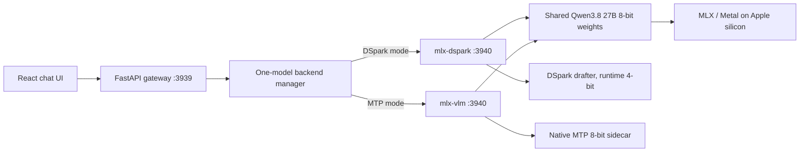

# Architecture

This document records the implementation boundaries and invariants behind the
Qwen3.8 27B Playground. The README is the operator guide.

## Goals and constraints

The project is a single-user, local-first Qwen3.8-27B playground for a
high-memory Apple silicon Mac. Its priorities are high-quality 8-bit inference,
real speculative acceleration, streamed reasoning, multimodal access, warm
multi-turn behavior, and repeatable one-command setup.

There is no CPU fallback. The supported execution device is Apple silicon
through MLX/Metal. DSpark is deliberately text-only; MTP owns the vision path.
The app exposes chat and local runtime controls, not every endpoint offered by
the upstream servers.

## System shape

The backend port is private implementation plumbing. The manager never keeps
both child runtimes resident, preventing duplicate target allocations and
ambiguous cache ownership.

## Component ownership

| Layer        | Files                  | Responsibility                                                                            |
| ------------ | ---------------------- | ----------------------------------------------------------------------------------------- |
| Browser      | `app/`                 | Transcript, attachments, settings, streamed rendering, metrics, mode controls             |
| Gateway      | `server/app.py`        | Child lifecycle, request validation, backend translation, SSE normalization, cancellation |
| DSpark child | pinned `mlx-dspark`    | Target/drafter loading, calibration, speculative verification, recurrent prefix cache     |
| MTP child    | pinned `mlx-vlm`       | Vision preprocessing, native MTP, APC, Qwen chat template, continuous response generation |
| Bootstrap    | `setup.sh`, `scripts/` | Private Python, model downloads, browser build, launch locks, foreground lifetime         |

## Backend lifecycle

At gateway startup the manager reads `.runtime/selected-backend`; invalid or
missing state falls back to MTP. Starting a backend is asynchronous so the
browser can open and present a truthful loading state while the model is mapped.

A transition performs these operations in order:

1. Close active upstream response streams.
2. Terminate the old child process and wait for Metal resources to release.
3. Spawn the requested runtime on `127.0.0.1:3940` with project-local paths.
4. Poll its health endpoint while also watching its process exit status.
5. Mark the gateway ready and persist the successful backend selection.

Another backend switch is rejected while a transition is active. The browser
also disables generation and mode controls during loading.

The backend remains in the launcher’s terminal process group, so Terminal HUP
reaches it even if the gateway cannot perform graceful shutdown. The gateway
also records `.runtime/backend.pid`; the launcher validates that PID’s full
command before cleanup and can recover the project’s own orphan on the next
run without touching an unrelated process that happens to use the same port.

## Model and quantization choices

Both modes use `mlx-community/Qwen3.8-27B-8bit`. This is intentional for a
128 GB M5 Max: it retains more quality than the 4-bit target, fits comfortably,
and more closely matches the FP8 verifier against which the external DSpark
head was trained.

The DSpark checkpoint is BF16 on disk. mlx-dspark loads and quantizes it to
4-bit, while reusing the target embedding and output head. It measures the
machine/model/quant verification curve and selects the static draft cap; for the
8-bit Qwen target this is expected to settle near four. Lookup drafts are off
because that is the measured default for this model pair.

The MTP sidecar is already 8-bit and uses block size three. Every proposed token
is verified by the target; speculative decoding changes execution cost, not the
target distribution.

## Prompt and response flow

The browser maintains the visible transcript and sends it on each request. A
stable printable session ID becomes an APC tenant in MTP mode and identifies an
active stream for cancellation. It is not a credential or stored conversation.

Qwen’s chat template pre-opens `<think>` in Thinking mode. MLX-VLM already emits
reasoning separately. mlx-dspark’s OpenAI streaming endpoint currently emits the
raw Qwen stream through `content`, so the gateway uses an incremental state
machine that:

- starts inside the pre-opened reasoning block;
- buffers only a possible suffix of `</think>`;
- emits reasoning as `reasoning_content`;
- removes the closing marker; and
- routes the remainder to normal `content`.

Off mode bypasses this filter. Low, Medium, and XHigh are passed through as
Qwen3.8's native `reasoning_effort` template argument. Previous reasoning is
displayed but excluded from the next browser transcript.

## Context budgeting

The browser treats 262,144 as the default output ceiling. Before proxying a
request, the gateway renders Qwen's chat template with the selected thinking
effort, counts its prompt tokens, and bounds generation to `262144 - prompt`.
MLX-VLM's exact context-budget error is also recognized and retried once with
the reported remaining budget, covering multimodal token expansion that a
text tokenizer cannot predict exactly.

## Images

The browser accepts base64 PNG and JPEG data URLs up to 20 MB. It checks type and
advertised size before reading; the gateway independently validates data-URL
shape, base64 integrity, and decoded size. MTP forwards OpenAI image parts to
MLX-VLM’s Qwen vision processor. Unlike the Muse reference UI, Qwen can receive
an image on more than one conversation turn.

DSpark rejects any request containing image parts. The UI disables DSpark when
the current transcript or composer contains an image, but the server check is
authoritative.

## Prefix caches

DSpark keeps four conversation slots and snapshots Qwen’s recurrent state every
8,192 prompt tokens. Exact continuation and compatible checkpoint reuse reduce
repeat prefill for agent and chat workloads.

MTP enables MLX-VLM APC with 16,384 blocks of 16 tokens, enough to cover the
configured 262K window. The browser session ID is sent as `X-APC-Tenant` to
prevent unrelated sessions from sharing cache identities.

Editing and New Chat use compatibility lifecycle endpoints at the gateway.
They cancel active streams and change the browser’s session identity; upstream
caches remain bounded by their own LRU/pool policies.

## Streaming metrics

The upstream protocols differ:

- mlx-dspark attaches `x_mlx_dspark` with throughput, mean acceptance length,
  draft cap, and target forwards.
- mlx-vlm attaches OpenAI-style `timings` with prompt/decode rates, APC reuse,
  memory, and MTP proposal/acceptance totals.

The gateway emits a common `qwen_metrics` SSE data frame. It tokenizes the
separated reasoning text with the target’s own tokenizer so both backends report
thinking tokens consistently. The browser combines this with OpenAI usage and
its own wall clock to display throughput, TTFT, token counts, and accepted tokens
per speculative round.

## Cancellation

`POST /api/cancel` closes the active upstream response for the supplied session.
Both child runtimes observe a disconnected stream and stop at a safe generation
boundary. A request already inside a long prefill or vision operation may not
stop until that operation reaches an interruptible boundary. Browser abort is a
fallback if no matching active response exists.

## Reproducibility

The following are pinned:

- all three Hugging Face repository revisions;
- mlx-vlm’s Qwen3.8-capable commit;
- mlx-dspark 0.10.1’s commit;
- the tested MLX, MLX-LM, and Transformers versions beneath both engines;
- Python server packages;
- the project-local `uv` binary and checksum;
- npm dependency resolution.

Model completeness is validated by required configs and nonempty safetensor
files. This is revision-pinned rather than bit-for-bit hermetic: macOS, MLX Metal
kernels, Python wheel indexes, and compiler/runtime behavior can still evolve.

## Generated state

| Path                                 | Contents                                          |
| ------------------------------------ | ------------------------------------------------- |
| `.runtime/models/`                   | Pinned target and both drafter repositories       |
| `.runtime/python/`, `.runtime/venv/` | Private Python 3.12 and packages                  |
| `.runtime/cache/`                    | uv, pip, npm, Hugging Face, and runtime caches    |
| `.runtime/selected-backend`          | Last backend that reached ready state             |
| `.runtime/backend.pid`               | Validated lifecycle handle for the resident child |
| `node_modules/`, `build/`            | Browser dependencies and production output        |

## Security boundary

The public server and private child bind to loopback. There is no CORS opt-in,
authentication, TLS, telemetry, or remote inference. The loopback boundary is a
deployment constraint, not authorization: another process running as the local
user can call the API. Do not change either host to a LAN/public interface
without adding a real security model.

Assistant Markdown does not enable raw HTML, and remote Markdown images are
rendered as inert text placeholders rather than fetched automatically. External
links require an explicit click and open with `noreferrer`.

## Maintenance checks

Before changing a runtime or model revision, verify:

- both backends load the pinned 8-bit target;
- Thinking and Off streams never leak `<think>` control markers;
- MTP accepts text and image requests;
- DSpark rejects images and reports nonzero speculative acceptance;
- switching releases the old child before loading the next;
- an exact follow-up reports prefix reuse;
- stop works during active decode;
- frontend tests, lint, build, and Python gateway tests pass.
