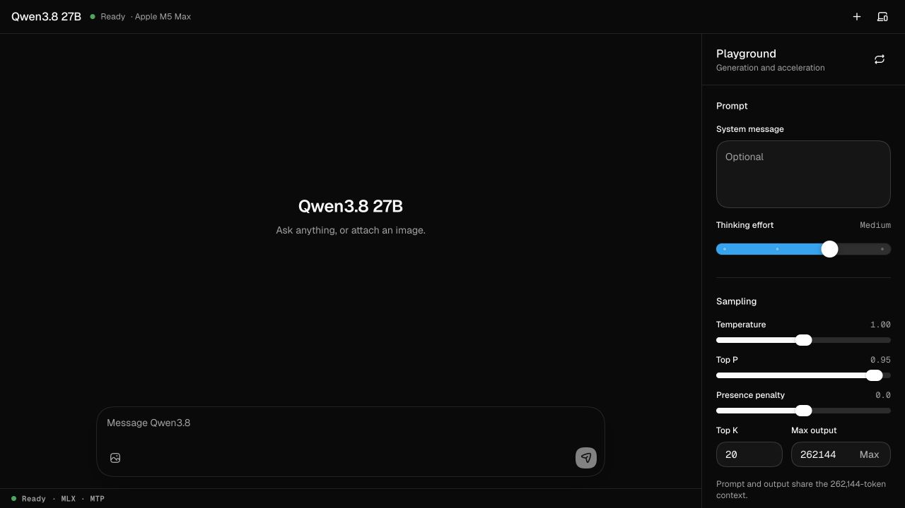

# Qwen3.8 27B Playground

A local Qwen3.8-27B vision, reasoning, and agent playground optimized for a
128 GB Apple M5 Max. It uses one shared 8-bit MLX target and can switch between
two lossless speculative decoders:

- **DSpark** for the fastest text, coding, and agent workloads.
- **MTP** for Qwen-native speculation with image support.



The app binds only to `127.0.0.1`. Conversations, images, reasoning, prompts,
and settings are kept in browser memory and are not uploaded or persisted by
the application.

## Setup

Requirements:

- Apple silicon Mac; 48 GB memory is a practical minimum for short contexts,
  while the configured 262K window is intended for this project’s 128 GB Mac.
- About 40 GB of free disk space.
- Node.js 20.19+, 22.12+, or 23+.
- Xcode command-line tools.

Run:

```bash
git clone https://github.com/mapleroyal/qwen-3.8-27b-mlx-playground.git
cd qwen-3.8-27b-mlx-playground
./setup.sh
```

Setup creates a private Python 3.12 environment, installs pinned MLX runtimes,
downloads the three pinned model repositories, builds the browser app, and
creates **Qwen3.8 27B.command**. No Python package is installed globally.

Afterward, double-click **Qwen3.8 27B.command** or run:

```bash
./Qwen3.8\ 27B.command
```

Keep the launcher’s Terminal window open. Control-C or closing that Terminal
window stops both the gateway and loaded MLX backend. The launcher also detects
and safely unloads a verified leftover project backend before relaunching.

## Acceleration modes

| Mode   | Target            | Drafter                                  | Best use                                   | Vision |
| ------ | ----------------- | ---------------------------------------- | ------------------------------------------ | ------ |
| DSpark | Qwen3.8-27B 8-bit | RadixArk DSpark, loaded at 4-bit         | Text, coding, agents, warm multi-turn chat | No     |
| MTP    | Qwen3.8-27B 8-bit | Qwen native 8-bit MTP head, block size 3 | General chat and multimodal requests       | Yes    |

Only one mode is resident. Switching stops the current child runtime, releases
its Metal allocations, and loads the other runtime against the same target
files. A text-only transcript remains in the browser across a switch. DSpark is
disabled while the transcript or composer contains an image.

DSpark uses machine-specific verification-cost calibration, the measured
Qwen3.8 default of no lookup drafts, four prefix-cache slots, and recurrent-state
checkpoints every 8,192 prompt tokens. MTP uses MLX-VLM Automatic Prefix Caching,
one decode sequence, and a three-token native draft block.

The app exposes Qwen3.8’s full native 262,144-token context window and starts
with **Max output** set to that full ceiling. The field is an output cap: before
each request, the gateway counts the formatted conversation and gives generation
the exact remaining context. The **Max** button restores the 262,144-token cap
without making prompt plus generation exceed the model window.

### M5 Max smoke measurements

On the 128 GB Apple M5 Max used to build this project, the same deterministic
65-token prompt and 97-token completion produced:

| Mode   | Decode rate | Speculation result                     | Peak MLX memory |
| ------ | ----------: | -------------------------------------- | --------------: |
| DSpark |  41.5 tok/s | 4.04 committed tokens per target round |         32.1 GB |
| MTP    |  38.6 tok/s | 61 of 72 drafted tokens accepted       |         31.4 GB |

For a 1280×720 image request, MTP processed a 910-token multimodal prompt in
1.19 seconds, then reused 894 tokens on the identical request and reduced that
prefill to 0.17 seconds. These are end-to-end smoke measurements, not a formal
benchmark; prompt shape and draft acceptance can move decode speed materially.

## Model sources

Setup downloads these repositories into `.runtime/models/` at exact revisions:

| Purpose       | Repository                           | Revision                                   |
| ------------- | ------------------------------------ | ------------------------------------------ |
| Shared target | `mlx-community/Qwen3.8-27B-8bit`     | `815b83c0df8ffd1d1b5244cf75fd6ef14fca9ef9` |
| Native MTP    | `mlx-community/Qwen3.8-27B-MTP-8bit` | `e88e48d055732ad75d9435f3059139d5279f2064` |
| DSpark        | `RadixArk/Qwen3.8-27B-DSpark`        | `923ed3a8572615643f0137e424e4ce4edd7f1cda` |

Runtime implementations are also commit-pinned in `server/requirements.txt`:

- MLX-VLM Qwen3.8 release candidate: `7b0c281055e483d83667f2fd62a2ca243657134a`
- mlx-dspark 0.10.1: `9fd1ae0643706968f37b8a97a63b368a182eaa1a`

## Features

- Live answer and reasoning streaming with Qwen’s thinking kept in a separate,
  collapsible disclosure.
- Four discrete thinking-effort stops: Off, Low, Medium, and XHigh, with Medium
  as the default.
- DSpark/MTP switching with clear capability and loading states; MTP is the
  clean-install default, and later launches remember the last ready backend.
- PNG and JPEG input in MTP mode; an image can be added on any user turn.
- Markdown, tables, links, code fences, and copy/edit/regenerate controls.
- Per-response TTFT, throughput, input/output/thinking token counts, and
  speculative acceptance data.
- Warm prefix reuse for multi-turn conversations in both modes.
- System message and official Qwen-style sampling controls.
- Light, dark, and system themes plus responsive desktop/mobile layouts.
- OpenAI-shaped streaming API for local clients.

The browser sends visible assistant answers back as conversation history but not
the previous private reasoning trace. This is intentional and matches common
reasoning-model API behavior.

## Local API

The gateway serves `POST /v1/chat/completions` at
`http://127.0.0.1:3939`. It adds `session_id`, cancellation, backend switching,
metrics normalization, and DSpark thinking-stream separation around the two
upstream OpenAI-compatible servers.

```bash
curl -N http://127.0.0.1:3939/v1/chat/completions \
  -H 'Content-Type: application/json' \
  -d '{
    "model": "qwen3.8-27b",
    "messages": [{"role": "user", "content": "Explain speculative decoding briefly."}],
    "enable_thinking": true,
    "reasoning_effort": "medium",
    "temperature": 1.0,
    "top_p": 0.95,
    "top_k": 20,
    "max_tokens": 2048,
    "stream": true,
    "stream_options": {"include_usage": true}
  }'
```

Switch modes:

```bash
curl -X POST http://127.0.0.1:3939/api/backend \
  -H 'Content-Type: application/json' \
  -d '{"backend":"mtp"}'
```

`GET /api/runtime` reports loading state and capabilities. Backend changes are
asynchronous; poll that route until `state` is `ready`.

## Development checks

```bash
npm run test:run
npm run lint
npm run build
.runtime/venv/bin/python -m pytest -q server/test_app.py
```

Generated models, environments, caches, dependencies, and builds are ignored by
Git. See [ARCHITECTURE.md](ARCHITECTURE.md) for runtime boundaries and maintenance
details, and [THIRD-PARTY-NOTICES.md](THIRD-PARTY-NOTICES.md) for upstream notices.
